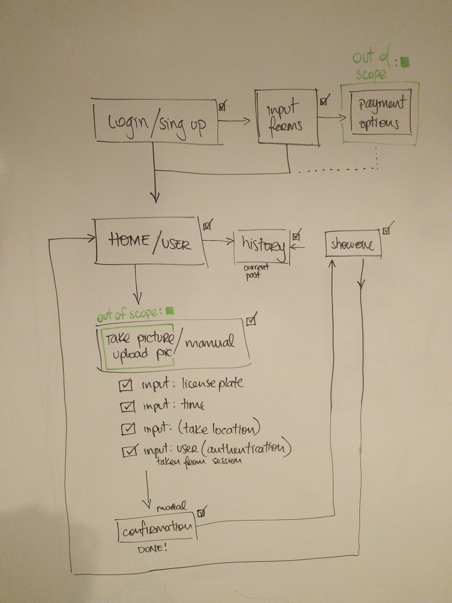
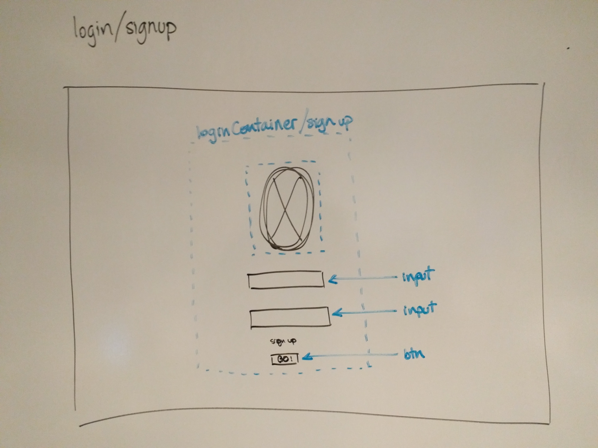
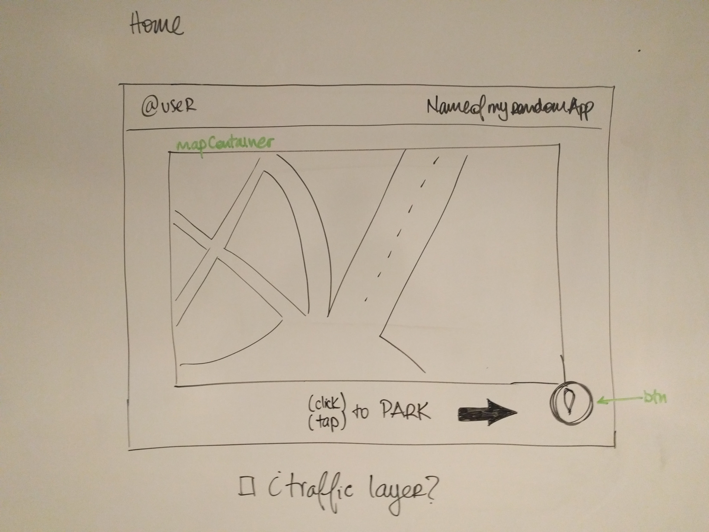
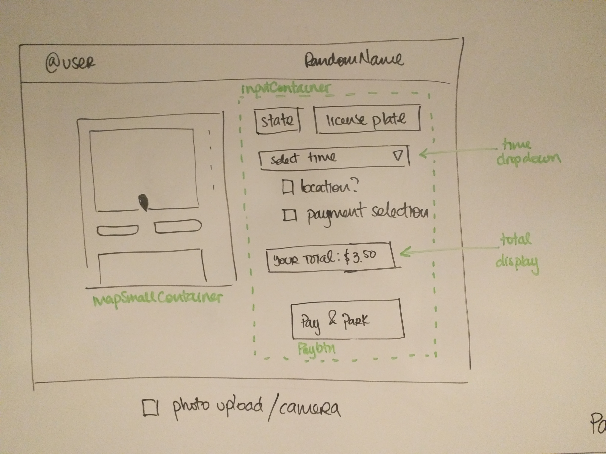

# iParkMyself
### Jonathan Ahrens  
WDI NYC 60  
General Assembly, 2016  

### User story
Parking is wicked complicated. Parking meters suck even more. This app will give the user the capability to register their license plate in a Database that will hold a timestamp, a payment and a location. This will allow to substitute the current physical system with a digital system.

Local enforcement agencies will be able to access this system as administrator users and scan or enter manually license plates and check if the paring fee is paid correctly. If not a ticket would be generated.

Users will be able to look at their current parking spot, see the remaining time and the fee paid until that moment. The application will let the user know when he's running out of time and will allow user to add time by making another payment.

### User Flow

### Wireframes
Signup

Home Page

Create Page

### Technologies
- [ ] Node.js
- [ ] Javascript
- [ ] Express.js
- [ ] React.js
- [ ] Heroku
- [ ] React
- [ ] WebPack
- [ ] OCR (maybe overshooting)

### Timeframe
##### Wed, Dec 7
- [ ] Hackathon
- [ ] Webpack

##### Thu, Dec 8
- [ ] Hackathon
- [ ] Server setup

##### Fri, Dec 9
- [ ] Webpack
- [ ] React Router

##### Sat, Dec 10
- [ ] Component Creation
- [ ]

##### Sun, Dec 11
##### Sun, Dec 11

###### Coffee Cups Consumed per day
Day | Coffee
:---: | :---
Mon Dec 5, 2016 | ☕☕☕☕☕☕☕
Tue Dec 6, 2016 | ☕☕☕☕☕
