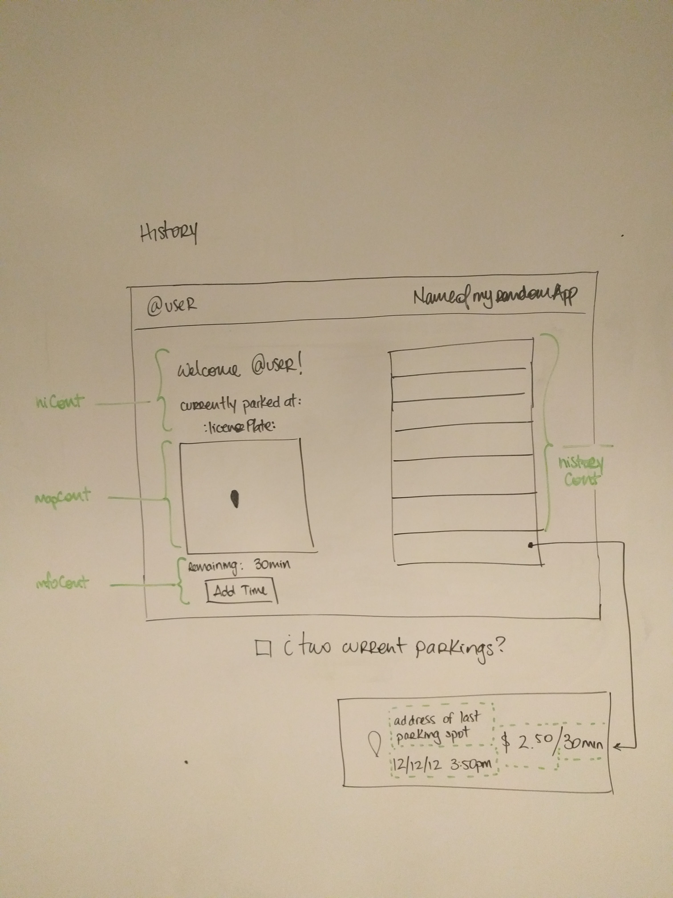

# iParkMyself
### Jonathan Ahrens  
WDI NYC 60  
General Assembly, 2016  

### User story
Parking is wicked complicated. Parking meters suck even more. This app will give the user the capability to register their license plate in a Database that will hold a timestamp, a payment and a location. This will allow to substitute the current physical system with a digital system.

Local enforcement agencies will be able to access this system as administrator users and scan or enter manually license plates and check if the paring fee is paid correctly. If not a ticket would be generated.

Users will be able to look at their current parking spot, see the remaining time and the fee paid until that moment. The application will let the user know when he's running out of time and will allow user to add time by making another payment.

### User Flow

### Wireframes
Signup

Home Page

Create Page

User History

### Technologies
- [x] Node.js
- [x] Javascript
- [x] Express.js
- [x] React.js
- [x] WebPack
- [ ] React Router
- [ ] OCR (maybe overshooting)
- [ ] Heroku

### Timeframe
##### Wed, Dec 7
- [x] Hackathon (why would they do this to us)

##### Thu, Dec 8
- [x] Hackathon
- [x] NPM init, package.json
- [x] .gitignore
- [x] Basic server setup
- [x] Server setup
- [x] Webpack

##### Fri, Dec 9
- [x] Routes, CRUD and PSQL

##### Sat, Dec 10
- [x] Index.jsx and App.jsx static elements

##### Sun, Dec 11
- [x] Models
    - [x]  User Model CRUD
- [x] Read up on React Router

##### Mon, Dec 12
- [x] Component Creation
- [x] Styling
- [x] Google Maps API

##### Tue, Dec 11
- [ ] Google Maps API in React
- [ ] React Router
- [ ] Even more Stuff

##### Wed, Dec 11
- [ ] ~~OCR~~
- [ ] ~~Amazon Web Services~~
- [ ] Burn the house down.

###### Coffee Cups Consumed per day
Day | Coffee | RedBull | Cigarettes | Beers
:--- | :--- | :---: | :--- | :---
Mon Dec 5, 2016 | ☕☕☕☕☕☕☕ | ⚡ | 🚬🚬🚬|
Tue Dec 6, 2016 | ☕☕☕☕☕☕ | | 🚬|
Wed Dec 7, 2016 | ☕☕☕☕☕ | | 🚬|
Thu Dec 8, 2016 | ☕☕☕☕ |⚡| 🚬|
Fri Dec 9, 2016 | ☕☕☕☕ | | 🚬🚬🚬|🍺
Sat Dec 10, 2016 | ☕☕☕☕☕ | | |🍺
Sun Dec 11, 2016 | ☕☕☕☕ |⚡|🚬|
Mon Dec 12, 2016 | ☕☕☕☕ |⚡| 🚬🚬|🍺🍺
Tue Dec 13, 2016 | | | |
Wed Dec 14, 2016 | | | |

